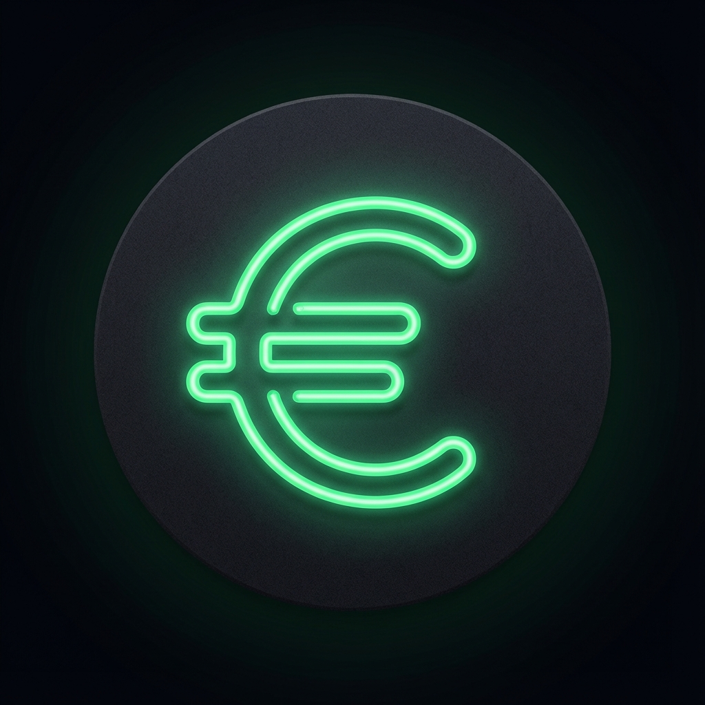

# 💶 Minijob Takip

<p align="center">
  
</p>

<p align="center">
  <strong>Almanya'daki minijob kazançlarınızı takip edin</strong><br>
  Modern, mobil-öncelikli PWA uygulaması
</p>

<p align="center">
  
  
  
</p>

---

## ✨ Özellikler

### 📊 Dashboard
- **Aylık kazanç takibi** - Ay bazında toplam kazancınızı görün
- **Görsel grafik** - Chart.js ile günlük kazanç grafiği
- **EUR/TRY dönüşümü** - Canlı döviz kuru ile TL karşılığı (🇹🇷)

### 💰 Kayıt Ekleme
- **Günlük mod** - Sabit tutar girişi
- **Saatlik mod** - İki farklı giriş yöntemi:
  - Manuel saat girişi
  - Giriş/Çıkış saati (mola dahil otomatik hesaplama)
- **Saatlik ücret kaydetme** - Varsayılan ücret otomatik hatırlanır

### ✏️ Kayıt Yönetimi
- **Swipe-to-reveal** - Sola kaydırarak düzenle/sil butonları
- **Düzenleme** - Var olan kayıtları güncelleyebilme
- **Tümünü temizle** - Tüm kayıtları silme seçeneği

### 📱 PWA Desteği
- **Ana ekrana ekle** - Mobil uygulama gibi kullan
- **Offline çalışma** - İnternet bağlantısı olmadan da çalışır
- **Yerel depolama** - Veriler cihazda güvenli şekilde saklanır

---

## 🚀 Kurulum

### Gereksinimler
- Node.js 14+
- npm veya yarn

### Adımlar

```bash
# Repoyu klonla
git clone https://github.com/kullaniciadi/minijob-calculator.git

# Klasöre gir
cd minijob-calculator

# Bağımlılıkları yükle
npm install

# Sunucuyu başlat
npm start
```

Tarayıcıda `http://localhost:3000` adresine git.

---

## 📁 Proje Yapısı

```
minijob-calculator/
├── public/
│   ├── index.html      # Ana HTML
│   ├── app.js          # Uygulama mantığı
│   ├── style.css       # Stiller
│   ├── manifest.json   # PWA manifest
│   └── favicon.png     # Uygulama ikonu
├── server.js           # Express sunucu
├── package.json        # Proje konfigürasyonu
└── README.md           # Bu dosya
```

---

## 🛠️ Teknolojiler

| Teknoloji | Kullanım |
|-----------|----------|
| **Express.js** | Web sunucusu |
| **Chart.js** | Kazanç grafiği |
| **Frankfurter API** | EUR/TRY döviz kuru |
| **localStorage** | Veri depolama |
| **Font Awesome** | İkonlar |
| **Google Fonts (Inter)** | Tipografi |

---

## 🎨 Tasarım Özellikleri

- **Glassmorphism** efektleri
- **Gradient** arka planlar
- **Koyu tema** göz yormayan tasarım
- **Micro-animasyonlar** akıcı kullanıcı deneyimi
- **Mobil-öncelikli** responsive tasarım

---

## 📄 Lisans

Bu proje ISC lisansı altında lisanslanmıştır.

---

## 🤝 Katkıda Bulunma

1. Fork edin
2. Feature branch oluşturun (`git checkout -b feature/yeni-ozellik`)
3. Değişikliklerinizi commit edin (`git commit -m 'Yeni özellik eklendi'`)
4. Branch'e push edin (`git push origin feature/yeni-ozellik`)
5. Pull Request açın

---

<p align="center">
  <strong>⭐ Beğendiyseniz yıldız vermeyi unutmayın!</strong>
</p>
